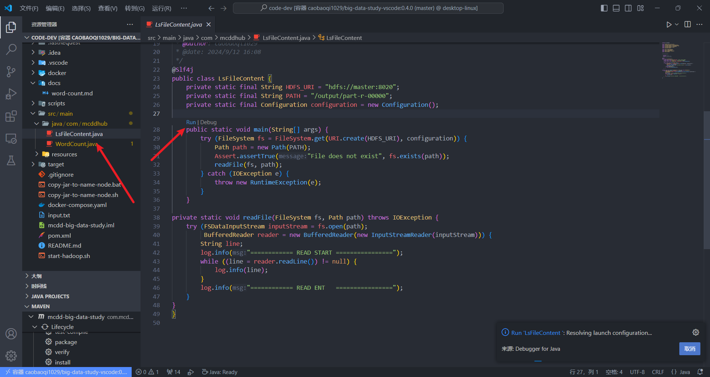
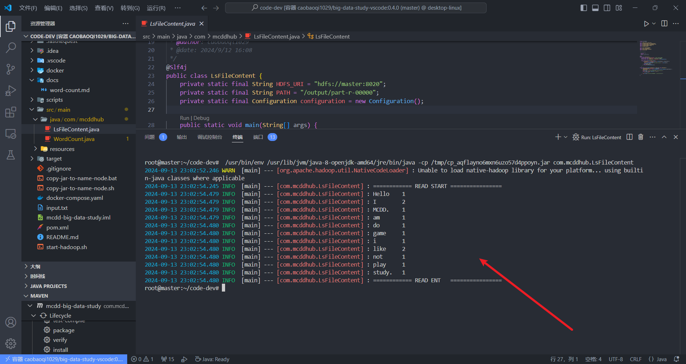

<div align="center">
<h1 align="center">Mcdd-Big-Data-Study</h1>
study project for big data (hadoop、zookeeper、kafka、flink、spark)
</div>

## 功能 ✨

> [!NOTE]
>
> - hadoop 3.3.6 (with jdk 8.0.352-zulu、maven 3.6.3)
> - zookeeper 3.9.2
> - kafka_2.12-3.7.1

## 安装 📦

1. `git clone https://github.com/mcddhub/mcdd-big-data-study.git --depth=1 && cd mcdd-big-data-study`
2. 构建镜像

```sh
cd docker
docker build -t caobaoqi1029/big-data-study:x.x.x .
```

> [!TIP]
>
> 注意将 x.x.x 替换


```sh
docker compose up -d
```


## 配置 🛠

通过 vs code 远程连接到远程服务器然后在命令界面选择 附加到正在运行的容器


安装 Java dev 拓展


然后重启拓展宿主


```sh
docker exec -it master bash
hdfs namenode -format # 启动 hadoop 环境
```


```sh
start-all.sh
```


使用 

```sh
vim input.txt
hdfs dfs -put -f ./input.txt /
hdfs dfs -ls /
```


```sh
mvn clean package
cd target/
hadoop jar big-data.jar
```

> [!TIP]
>
> 或者也可以通过 `export CLASSPATH=$CLASSPATH:/tmp/ # 将其写入 .bashrc 否则执行 jar 会提示找不到 XXX` 即可直接执行 Java 无需手动执行 mvn 命令


```sh
hdfs dfs -ls /output
hdfs dfs -cat /output/part-r-00000
```


或者(需要将 `export CLASSPATH=$CLASSPATH:/tmp/` 写入 .bashrc 否则执行 jar 会提示找不到 XXX)





## 更新日志 📅

- v0.4.0 (hadoop、zookeeper、kafka、code-server)

## 贡献 🤝

欢迎贡献！请随时提交拉取请求。有关详细信息，请参阅 [贡献指南](https://github.com/mcddhub/mcdd-big-data-study/blob/main/CONTRIBUTING.md)。

这个项目的存在感谢所有贡献者：

<a href="https://github.com/mcddhub/mcdd-big-data-study/graphs/contributors">
  
</a>

## 许可证 📄

此项目根据 MIT 许可证授权 -
有关详细信息，请参阅 [LICENSE](https://github.com/mcddhub/mcdd-big-data-study/blob/main/LICENSE) 文件。

## 支持 💖

如果你觉得这个项目有帮助，请考虑在 [GitHub](https://github.com/mcddhub/mcdd-big-data-study) 上给它一个 ⭐️！

## Star 历史 ⭐

<div align="center">

