<p align="center">
 
</p>
<div align="center">
  <h1 align="center">Mcdd-Big-Data-Study</h1>
  <p>Study project for big data (Hadoop, Zookeeper, Kafka, Flink, Spark)</p>
</div>

---

## Features ✨

> **Supported Technologies**:
>
> - **Hadoop 3.3.6** (with JDK 8.0.352-zulu, Maven 3.6.3)
> - **Zookeeper 3.9.2**
> - **Kafka 2.12-3.7.1**

---

## Installation 📦

1. Clone the repository:
   ```bash
   git clone https://github.com/mcddhub/mcdd-big-data-study.git --depth=1 && cd mcdd-big-data-study
   ```
2. Build the Docker image:
   ```bash
   cd docker
   docker build -t caobaoqi1029/big-data-study:x.x.x .
   ```

> **Note**: Replace `x.x.x` with the appropriate version number.

<div align="center">
  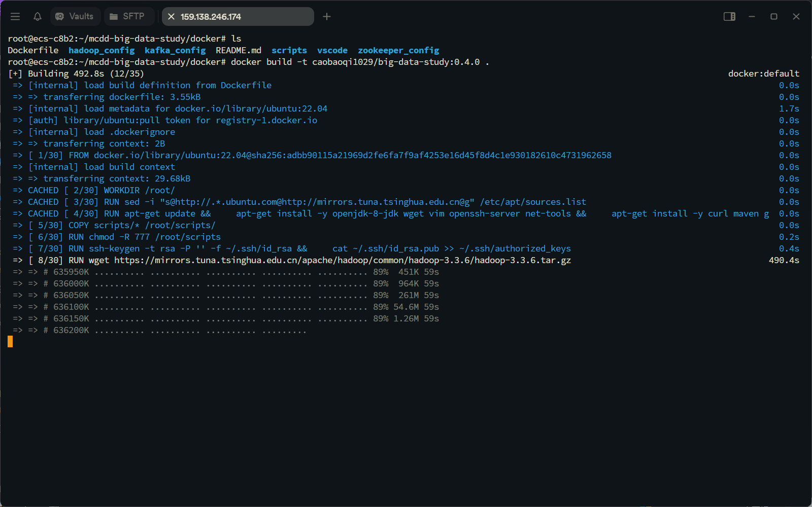
  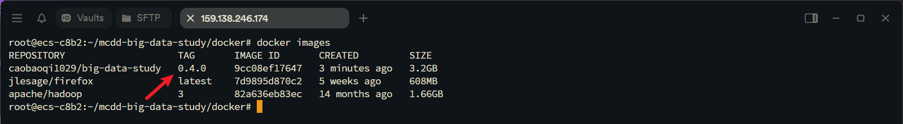
</div>

3. Start the containers:
   ```bash
   docker compose up -d
   ```

<div align="center">
  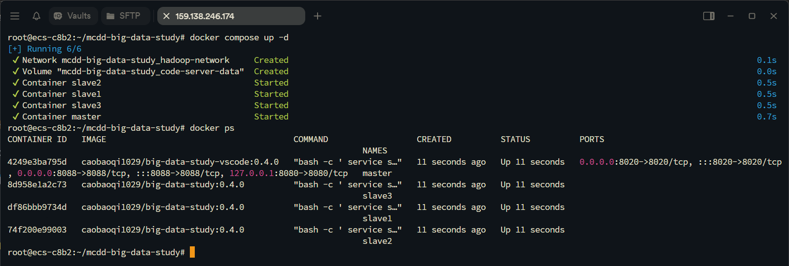
</div>

---

## Configuration 🛠

1. Connect to the remote server via **VS Code** and attach to a running container.

<div align="center">
  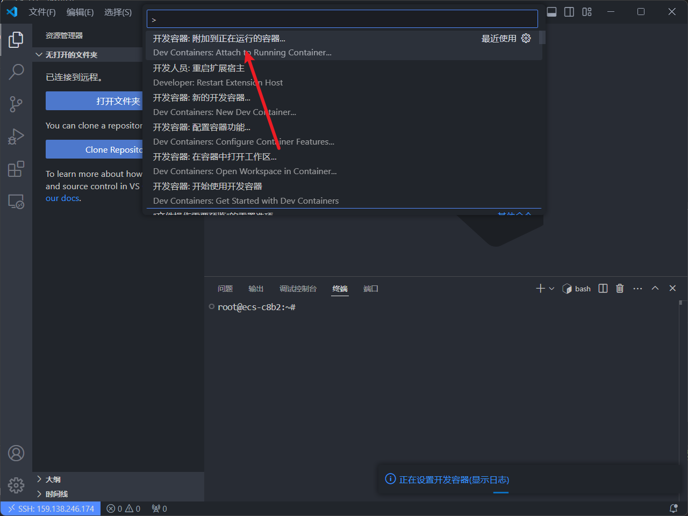
  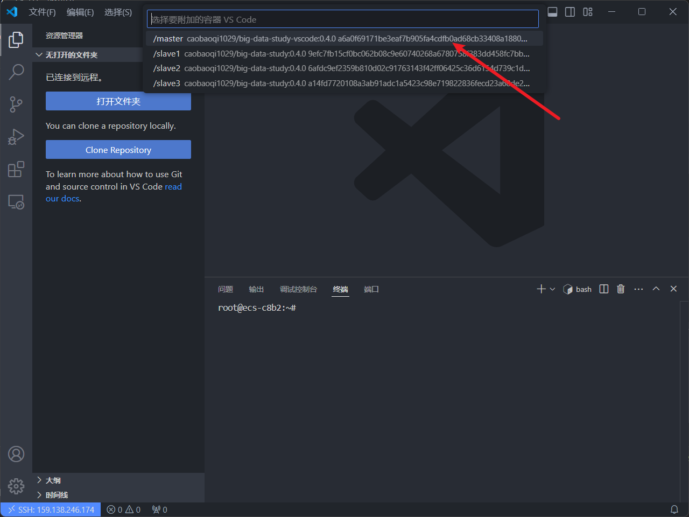
</div>

2. Install the **Java Dev** extension in VS Code.

<div align="center">
  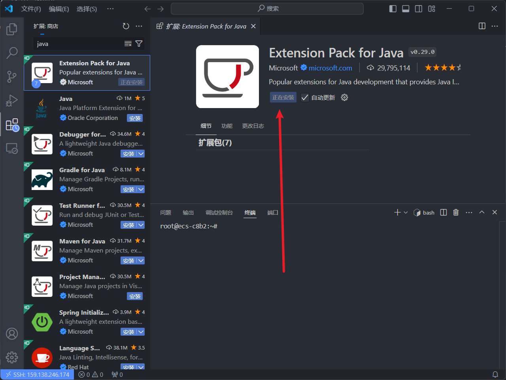
</div>

3. Restart the extension host to apply changes.

<div align="center">
  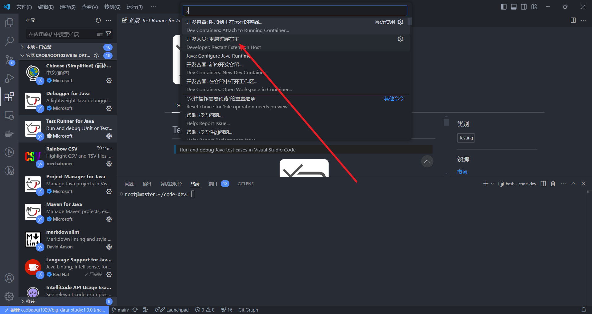
</div>

4. Initialize Hadoop environment:
   ```bash
   docker exec -it master bash
   hdfs namenode -format
   ```

<div align="center">
  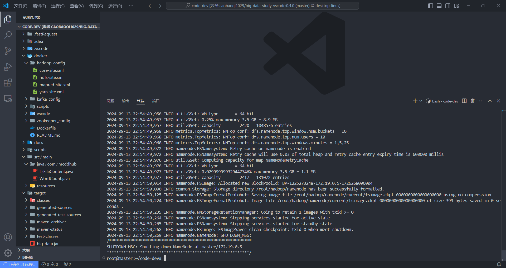
</div>

5. Start Hadoop services:
   ```bash
   start-all.sh
   ```

<div align="center">
  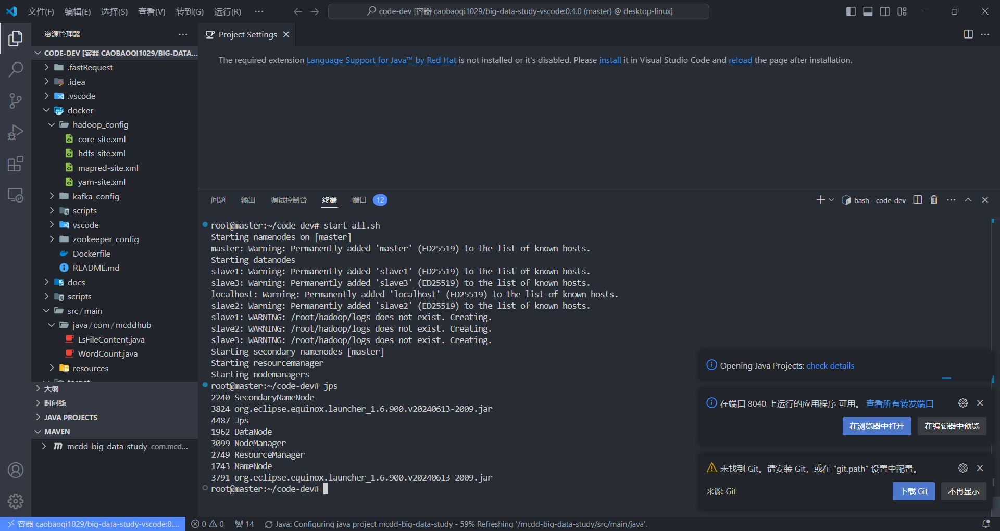
</div>

6. Use the following commands to interact with Hadoop:
   ```bash
   vim input.txt
   hdfs dfs -put -f ./input.txt /
   hdfs dfs -ls /
   ```

<div align="center">
  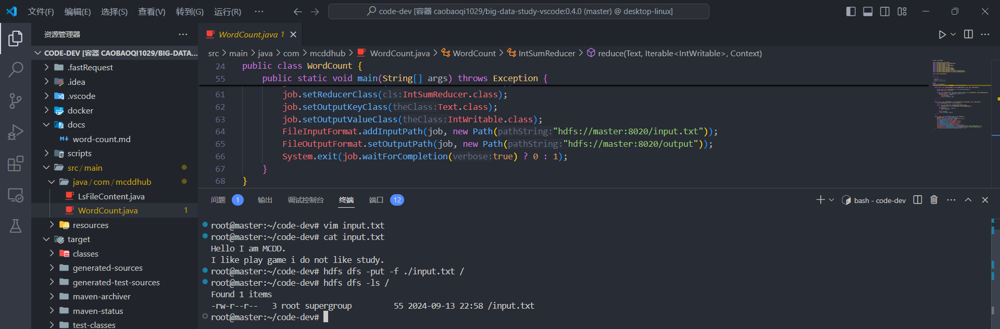
</div>

7. Build and run the Hadoop job:
   ```bash
   mvn clean package
   cd target/
   hadoop jar big-data.jar
   ```

> **Tip**: You can set the environment variable to run Java directly:
> ```bash
> export CLASSPATH=$CLASSPATH:/tmp/
> # Add this to .bashrc for persistence.
> ```

<div align="center">
  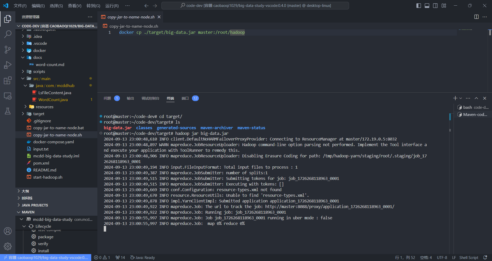
</div>

8. View the output:
   ```bash
   hdfs dfs -ls /output
   hdfs dfs -cat /output/part-r-00000
   ```

<div align="center">
  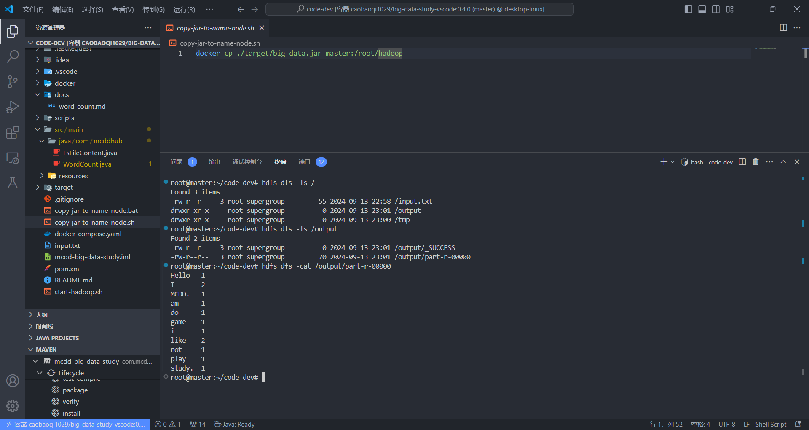
</div>

---

## Contributing 🤝

We welcome contributions! Feel free to submit a pull request. For more details, see the [Contribution Guide](https://github.com/mcddhub/mcdd-big-data-study/blob/main/CONTRIBUTING.md).

<div align="center">
  <p>Thanks to all contributors:</p>
  <a href="https://github.com/mcddhub/mcdd-big-data-study/graphs/contributors">
    
  </a>
</div>

---

## License 📄

This project is licensed under the MIT License. See the [LICENSE](https://github.com/mcddhub/mcdd-big-data-study/blob/main/LICENSE) file for details.

---

## Support 💖

If you find this project helpful, consider giving it a ⭐️ on [GitHub](https://github.com/mcddhub/mcdd-big-data-study)!

---

## Star History ⭐

<div align="center">
  
</div>
